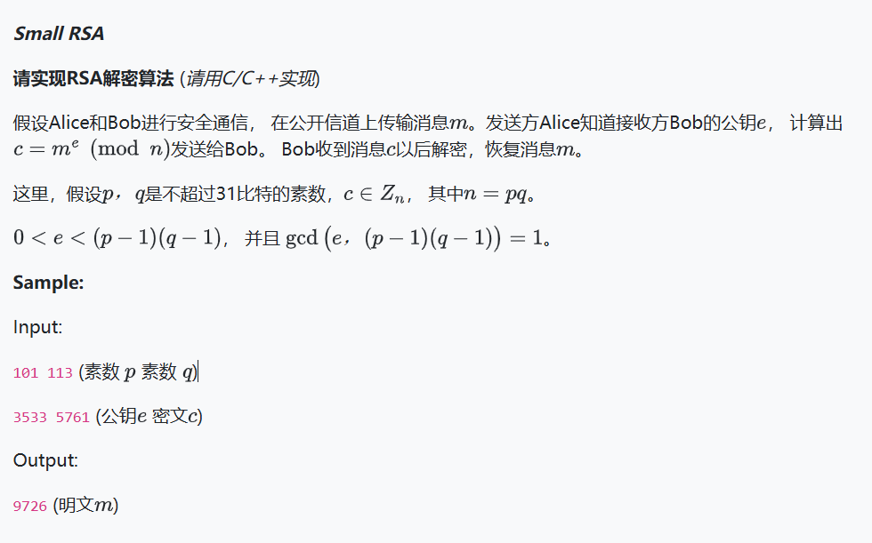

本次作业其实可以重用上学期的信安数基写过的代码，但是有的部分需要特别注意，可（我）能（的）易错点如下。

# Long long 与 Int 类型的数据转换

这里明确规定p和q是31位bit内的素数，那么很多同学可能直接用int来存了，但是计算n时需要注意

```c++
long long n = p * q //这样的代码会在int型上进行计算，再转化为long long，因此部分测试点会越界。

long long n = static_cast<long long int>(p) * static_cast<long long int>(q); //正确的写法应该是这样
```

# Long long 与 __int 128类型的使用

在计算e对n的逆元以及快速幂取模时，有可能在计算过程中出现 Long long类型越界而产生负数的情况，因此推荐两个函数的参数、临时变量都推荐使用__int 128类型。

# 快速幂取模

这里大多同学都是从低位到高位判断二进制位，为1时将基数平方并乘到结果上；为0时仅基数增加而结果不变。

我使用的是从高位到低位判断二进制位，为1时平方并乘a；为0时平方但不乘a。

拿a^6(mod m)举例，首先将6变成二进制的110。

第一种方法是从二进制低位判断，每向前判断一位，接下来运算的基数进行一次平方。当二进制位为0，跳过；为1，将之前的结果乘基数。即a^6=1 * a^2 * a^4 。

第二种方法是从二进制的最高位前1位判断。为1时，将之前结果平方并乘a；为0时，将之前结果平方。再看下一位…… 即a^6 = (a^2* a) ^ 2 。

两种方法测试下来都没有问题。
